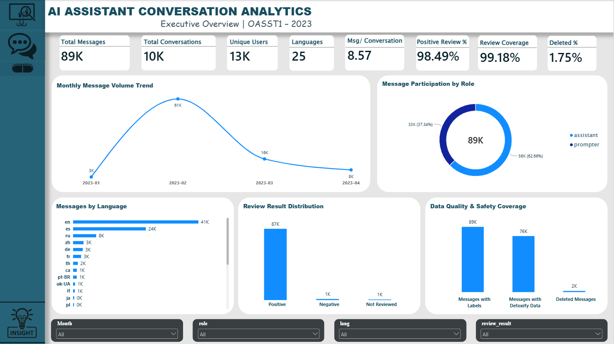
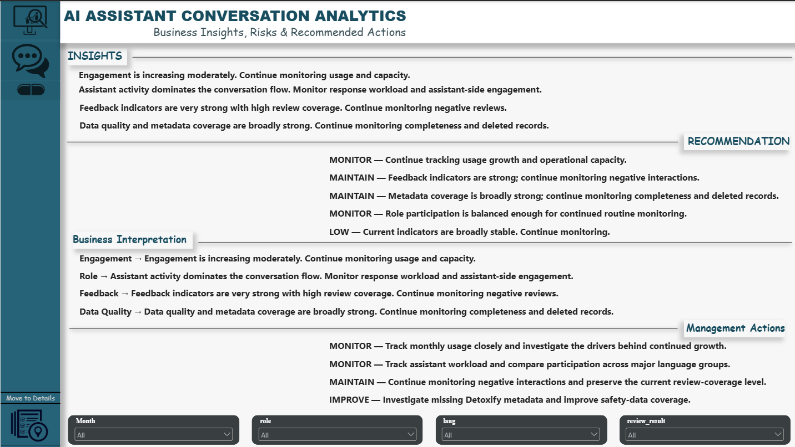

# 🤖 AI Assistant Conversation Analytics

### End-to-End Data Engineering & Business Intelligence Pipeline

> **Raw AI Assistant Conversation Data → ETL → Validation → SQLite → SQL → Python EDA → Power BI → Business Insights**

An end-to-end **Data Engineering and Business Intelligence project** built using the **OpenAssistant Conversations Dataset (OASST1)**.

The project transforms raw conversational data into a **clean, validated, structured, queryable SQLite database**, performs analytical processing using **SQL and Python**, and presents the results through an interactive **Power BI dashboard**.

---

## 📌 Project at a Glance

| Category | Details |
|---|---|
| **Project Type** | Data Engineering + Business Intelligence |
| **Dataset** | OpenAssistant Conversations Dataset (OASST1) |
| **Records** | 88,838 messages |
| **Conversations** | 10,364 |
| **Users** | 13,249 |
| **Languages** | 25 |
| **Final Fields** | 18 |
| **Database** | SQLite |
| **ETL** | Python |
| **Analysis** | SQL + Python EDA |
| **Visualization** | Power BI |
| **Version Control** | Git & GitHub |
| **ETL Execution Time** | ~31 seconds |
| **Pipeline Status** | ✅ Passed |

---

# 🎯 1. Project Objective

AI assistants generate large volumes of conversational data containing messages, users, languages, timestamps, reviews, conversation relationships, and metadata.

Raw conversational datasets can be difficult to analyse directly because of:

- Missing or optional metadata
- Inconsistent data structures
- Large numbers of records
- Parent-child conversation relationships
- Metadata requiring validation
- Lack of structured analytical storage
- Difficulty performing repeatable analysis directly on raw files

### Objective

Build a **modular, reproducible, and validated Data Engineering pipeline** that converts raw OASST1 conversation data into analysis-ready information and delivers actionable insights through SQL, Python EDA, and Power BI.

---

# 💡 2. Solution

The project follows a complete end-to-end data workflow:

```text
                    OASST1 RAW DATA
                           │
                           ▼
                    ┌─────────────┐
                    │   EXTRACT   │
                    │  ingest.py  │
                    └──────┬──────┘
                           │
                           ▼
                    ┌─────────────┐
                    │  TRANSFORM  │
                    │transform.py │
                    └──────┬──────┘
                           │
                           ▼
                    ┌─────────────┐
                    │   VALIDATE  │
                    │ Data Quality│
                    └──────┬──────┘
                           │
                           ▼
                    ┌─────────────┐
                    │    LOAD     │
                    │   load.py   │
                    └──────┬──────┘
                           │
                           ▼
                    ┌─────────────┐
                    │    SQLite   │
                    │   oasst.db  │
                    └──────┬──────┘
                           │
                ┌──────────┴──────────┐
                ▼                     ▼
          SQL Analysis            Python EDA
                │                     │
                └──────────┬──────────┘
                           ▼
                      Power BI
                           │
                           ▼
                Business Insights
                           │
                           ▼
                  Recommendations

```
## 📊 Power BI Dashboard



## 💼 Business Insights & Recommendations


